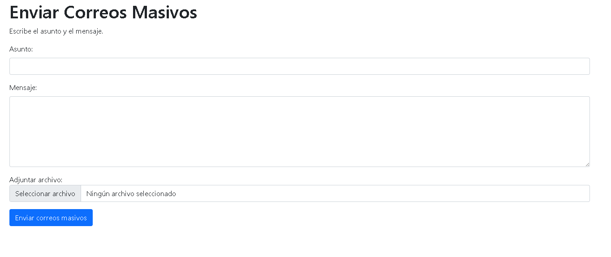

# PHPMailer Proyecto

Este proyecto utiliza PHPMailer para enviar correos, incluyendo envío masivo desde una base de datos.

## Imagen

## Funciones

- Envío de correo individual.
- Envío masivo de correos usando una base de datos.
- Formulario para enviar los correos.
